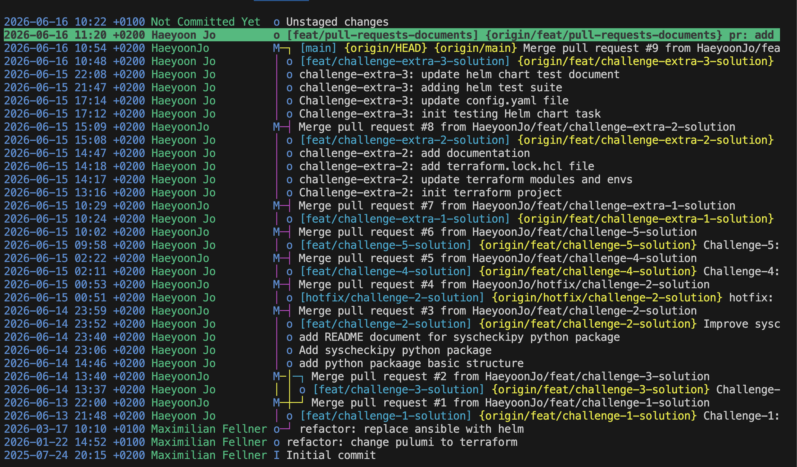

# PR

This `PRs` directory can show you clear perspectives of Git & branch strategy which branch has been used, what and how pull requests(PRs) were indicated and described the details for each challenges.

## Git & Branching Strategy
For this assignment, I followed a **GitFlow** or **git & branching strategy** approach:
- `main`: Production-ready code.
- `feat/*`: Isolated tasks (e.g., `feat/challenge-1`, `feat/challenge-extra-2`).
- `hotfix/*`: Urgent fixes for production issues.
- `pr/`: Documenting the Pull request details and information.

## Tracking git
- git log
Tracking Git logs are available using the standard `git log`.
```
git log
commit 4a53086602a165196b37bc662ea460037a6821b5 (HEAD -> pr/documents-pull-requests, origin/feat/pull-requests-documents)
Author: Haeyoon Jo <19848408+HaeyoonJo@users.noreply.github.com>
Date:   Tue Jun 16 11:20:23 2026 +0200

    pr: add pull requests as documents

commit 166439143f8da8020fd42143db9938d6d42e99c9 (origin/main, origin/HEAD, main)
Merge: 0ff2ba8 5103774
Author: HaeyoonJo <19848408+HaeyoonJo@users.noreply.github.com>
Date:   Tue Jun 16 10:54:30 2026 +0200

    Merge pull request #9 from HaeyoonJo/feat/challenge-extra-3-solution
    
    Challenge-extra-3: Test Helm Chart

commit 5103774cd9e5581c2dabc5378ee293b3cd75d1a2 (origin/feat/challenge-extra-3-solution, feat/challenge-extra-3-solution)
Author: Haeyoon Jo <19848408+HaeyoonJo@users.noreply.github.com>
Date:   Tue Jun 16 10:24:17 2026 +0200

    challenge-extra-3: adding helm test suite for deployment and service
    - update test suites with deployment and service
    - update document accordingly

commit 1bb775480ad8d5527ba1233685ce592accc9f790
Author: Haeyoon Jo <19848408+HaeyoonJo@users.noreply.github.com>
Date:   Mon Jun 15 22:08:09 2026 +0200

    challenge-extra-3: update helm chart test document

commit 841e9de6eef96a54a0386e3283de18800a00a60a
Author: Haeyoon Jo <19848408+HaeyoonJo@users.noreply.github.com>
Date:   Mon Jun 15 21:47:27 2026 +0200

    challenge-extra-3: adding helm test suite
```

- visually tracking the logs with `tig` 
`tig` is a text-mode interface for git and very useful to understand git flow visually.  
Installation is available using `brew install tig` as well as other methods which documented in the following link: https://jonas.github.io/tig/INSTALL.html

To view the git history using `tig` is simply type `tig` in your terminal. Please see the `tig` output in the attached screenshot below:
